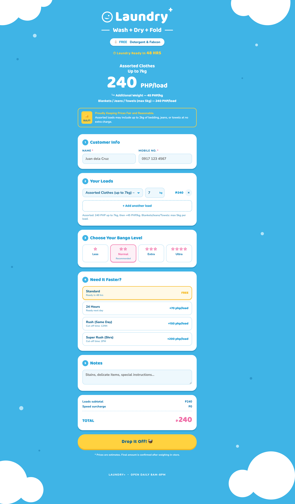

# Laundry+ — Wash + Dry + Fold 集配予約フォーム

コインランドリー/クリーニング店「Laundry+」の集配(ピックアップ&デリバリー)予約フォームです。
店頭フライヤーと同じデザイン(スカイブルー×バブルロゴ×雲)で、単一の `index.html` だけで動きます。



## 機能

- **Loads**: サービスと数量(kgまたは枚数)を入れると自動で料金計算
  - Wash + Dry + Fold: Assorted は12kgブロック方式 — 12kgごとのブロックに分割し、各ブロック=最初の7kgまで240 PHP+超過分45 PHP/kg(切り上げ、ブロック最大465 PHP)。例: 14kg = 465+240 = 705 PHP。Blankets・Jeans・Towels 240 PHP/5kgロード(5kg超は自動でロード追加計算)
  - per-load料金(スピード・Bleach等)の「load数」はブロック数(Assorted: ceil(kg/12)、Blankets: ceil(kg/5))
  - kg単価サービス(210/kg・155/kg)は開始kgごとに切り上げ(1.5kg → 2kg分)
  - 詳細仕様: [docs/laundry_plus_order_form_spec.md](docs/laundry_plus_order_form_spec.md)
  - Wash + Dry + Press: 210 PHP/kg(48–72時間仕上げ)
  - Single Services: Wash Only 150 / Dry Only 150 / Fold Only 80(各 最大7kg)
  - Press Only: 155 PHP/kg、または枚数単位(Tops 40 / Bottoms 55 / Simple Dress 80 / Long Dress 105 / Jacket 105 / Hanger w/ Dust Bag 20)
- **Bango Level**: 香り強さを None / Less / Normal / Extra / Ultra から選択
- **Separate load by(洗い分け)**: Whites & Colored / Beddings & Clothes / Beddings & Towels / Per Bag / Mixed(デフォルト・無料)から選択。Mixed以外は Additional Charge 表示(金額は店頭確認)。Per Bag 選択時はバッグ数(No. of Bags)が必須になり、注文データに「Per Bag × N bags」として記録
- **Add-ons**: Bleach(+20 PHP/load)/ Extra Detergent(+10 PHP/load)/ Laundry+ Bag(+200 PHP)
- **T&C同意**: 送信前に免責事項(EN+TL、アコーディオン表示)への同意が必須。未チェックでは送信ボタン無効。同意時刻をシートに記録
- **スピード**: Standard 48hrs(無料)/ 24 Hours(+70/load)/ Rush 同日(+150/load・締切12NN)/ Super Rush 5hrs(+200/load・締切2PM)
- **集配スケジュール**: 希望ピックアップ/デリバリーの日付(英語表記のプルダウン、14日先まで)と1時間スロットを選択
  - 集配時間: 平日 8AM–9PM / 週末 9AM–7PM(営業時間は毎日 5AM–11PM)
  - デリバリー日時はスピードに連動: 最短デリバリー = ピックアップ時刻 + 仕上がり時間(Standard=48h / 24 Hours=24h / Rush=6h / Super Rush=5h)。例: 11AMピックアップ + Super Rush → 最短4PMデリバリー
  - Rush(Same Day)はピックアップ4PMまで(`cutoff: 16`)。それ以降のピックアップではRushが選択不可になり、選択中だった場合はStandardに戻る(Super Rushは選択可)
  - スロットは GAS 側で1時間あたりの件数を制限(`SLOT_CAP`、デフォルト2件)。満枠・ブロック済みスロットは FULL 表示で選択不可
- **連絡先**: Facebook アカウント欄と希望連絡手段(SMS / Messenger)
- 送信するとクレーム番号(`LP-YYYYMMDD-HHMMSS`)を発行して完了画面を表示

## 管理画面(admin.html)

`admin.html` は集配スロットの空き状況ダッシュボードです。

- 日付ごとに各スロットの予約数(n/cap)、予約者(名前・電話・受付番号・スピード・ステータス)を表示
- スロット単位で **BLOCK / UNBLOCK** — ブロックしたスロットは予約フォームで FULL 表示になり選択不可
- アクセスには管理キーが必要: `gas/Code.gs` の `ADMIN_KEY` を自分だけの値に変更し、admin.html の Key 欄に同じ値を入力(端末に保存されます)
- ブロック情報はスプレッドシートの `BlockedSlots` シートに保存(直接編集も可)

## 使い方(ローカルで開く)

ビルド不要です。どちらかで開けます。

```bash
# 1) ファイルを直接開く
open index.html

# 2) ローカルサーバーで開く(推奨)
python3 -m http.server 8787
# → http://localhost:8787
```

## 料金・品目の変更

`index.html` 内の定数を編集するだけです。

- `LOAD_TYPES` — 品目と料金(base)、込み重量(includedKg)、超過単価(extraPerKg)、ロード単位重量(loadKg)、上限(max)
- `BANGO` — 香りレベル
- `SPEEDS` — 仕上がりスピードと追加料金(fee)、仕上がり時間(hours)、ピックアップ締切時刻(cutoff、24h表記)
- `ADDONS` — アドオン(`per: "load"` はロード数×fee、`per: "order"` は1回限りの固定額)
- `SEPARATION` — 洗い分けの選択肢
- `slotHours` — 集配スロットの時間帯(平日/週末)。スロット上限は `gas/Code.gs` の `SLOT_CAP`

## Google Apps Script(GAS)連携

送信処理は `submitToGAS(payload)` に分離されており、`GAS_ENDPOINT` にウェブアプリURLを
設定すると本番動作になります(空文字ならモック動作)。セットアップ手順:

1. Googleスプレッドシートを作成 → 拡張機能 → Apps Script
2. [`gas/Code.gs`](gas/Code.gs) の中身を貼り付けて保存
3. デプロイ → 新しいデプロイ → 種類「ウェブアプリ」→ アクセス「全員」でデプロイ
4. 発行されたウェブアプリURLを `index.html` の `GAS_ENDPOINT` に貼り付け

コードを修正したときは「デプロイ → デプロイを管理 → ✏️編集 → バージョン: 新バージョン → デプロイ」
で**URLを変えずに**更新できます。

payload の形:

```json
{
  "receiptNo": "LP-20260711-150429",
  "receivedAt": "2026-07-11T06:04:29.000Z",
  "name": "Juan dela Cruz",
  "phone": "0917 123 4567",
  "fb": "facebook.com/juandelacruz",
  "contactVia": "Facebook Messenger",
  "address": "123 Sample St., Brgy. Uno, Quezon City",
  "pickup": "2026-07-12 08:00",
  "delivery": "2026-07-14 18:00",
  "loads": [{ "type": "assorted", "label": "Assorted Clothes", "qty": 7, "unit": "kg", "amount": 240 }],
  "bango": "normal",
  "separation": "Whites & Colored",
  "addons": ["Bleach (+₱20/load)"],
  "prefs": ["Has delicate / hand-wash items"],
  "speed": "24hrs",
  "notes": "",
  "total": 640
}
```

スロット空き状況は `GET <GAS_ENDPOINT>?action=slots&date=YYYY-MM-DD` で
`{ "cap": 2, "counts": { "08:00": 1 } }` の形で返ります(CANCELLED の注文は除外)。
フォームは日付選択のたびにこれを取得し、満枠スロットを無効化します。

## GitHub Pages で公開する場合

リポジトリを Public にした上で: Settings → Pages → Branch を `main` / `(root)` にして Save。
数分後に `https://<ユーザー名>.github.io/laundry-plus/` で公開されます。
